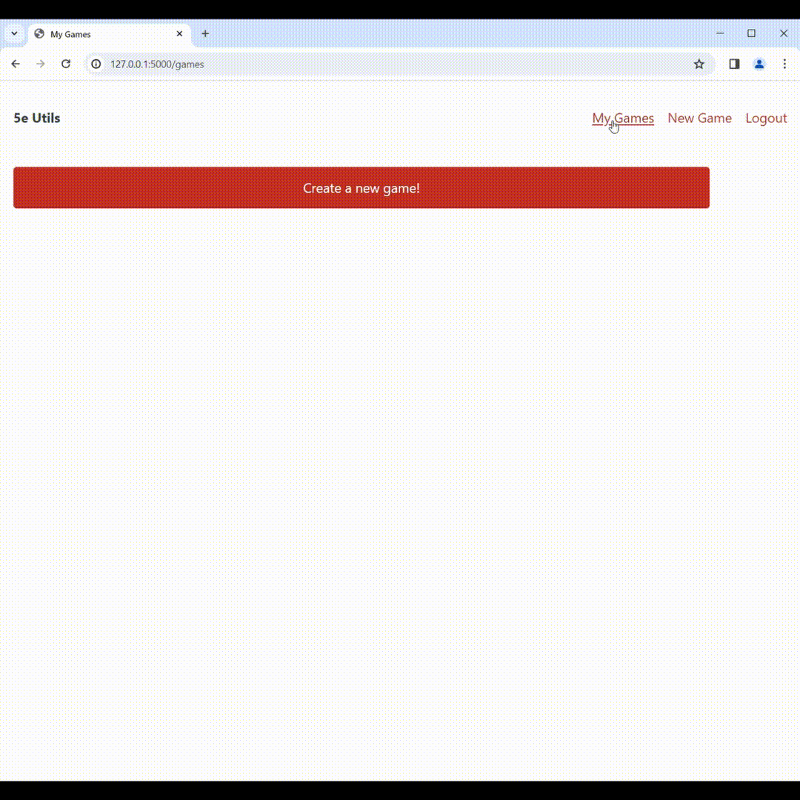

This app utilizes the [Open 5e Api](https://open5e.com/) to provide an easy combat tracker for Dungeons and Dragons 5e.

To get started, create an account on the home page. Please note that this is NOT a secure account, it is only to make it easier to come back to the campaigns and combats you have created.

Once you have made an account, you can now make a campaign. Campaigns keep track of all the monsters, characters, and combats you have created within them.

After creating a campaign, you can now begin to add monsters and characters to it. To add a monster, simply click on "add monster" and search for the creatures you want. When you click on a monster's name it will show detailed info and allow you to add it to the campaign.

The player character creation screen is modeled after 5e character sheets. You can use it to fill in all the basic character info, adjust the character's stats, and add or remove actions. Creating an NPC follows the same process.

Once you've added the monsters and characters you want, you can now create a new combat. Click on 'Create New Combat', give it a name, and add the creatures you want to the initiative order. You can then adjust their individual initiatives or remove them from the order entirely. Submitting the combat will bring you to the combat screen.

The combat screen displays each creature in order of its initiative. Here you can see each creature's available actions as well as easily adjust its health without needing to do any math.

